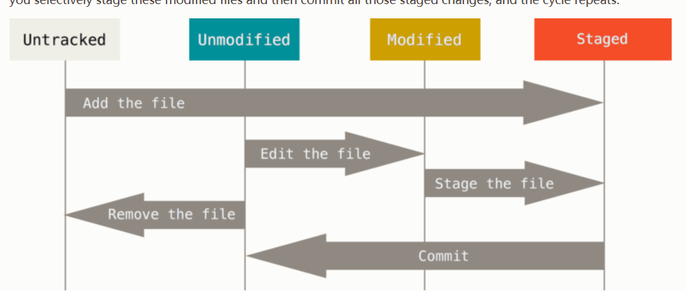

the lifecycle of the status of your files:




USEFUL THING:

#### git rm cached
Another useful thing you may want to do is to keep the file in your working tree but remove it from your staging area. In other words, you may want to keep the file on your hard drive but not have Git track it anymore. This is particularly useful if you forgot to add something to your .gitignore file and accidentally staged it, like a large log file or a bunch of .a compiled files. To do this, use the --cached option:
```git rm --cached README```


#### git mv A B

change the file name after staged

####  git log --pretty=format:"%h %s" --graph
some better view of git log:

```git log --pretty=format:"%h - %an, %ar : %s"```
```git log --pretty=format:"%h %s" --graph```

#### undo things

situation: when you commit your change and want to add some modifies to that commit again :
```
git commit -m 'Initial commit'
git add forgotten_file 
git commit --amend
```
situation: when you want to go from staged to unstaged 
if the file is staged:
```
git restore --staged CONTRIBUTING.md
```
then it will go from staged to unstaged

situation: when you want to unmodifying a modified 
```
git restore <file>
```
then it will go to unmodified